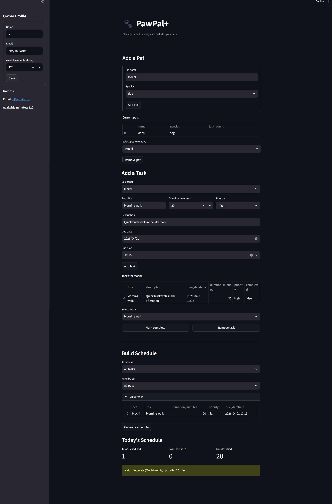

# PawPal+ (Module 2 Project)

You are building **PawPal+**, a Streamlit app that helps a pet owner plan care tasks for their pet.

---

## Scenario

A busy pet owner needs help staying consistent with pet care. They want an assistant that can:

- Track pet care tasks (walks, feeding, meds, enrichment, grooming, etc.)
- Consider constraints (time available, priority, owner preferences)
- Produce a daily plan and explain why it chose that plan

Your job is to design the system first (UML), then implement the logic in Python, then connect it to the Streamlit UI.

---

## System Overview

PawPal+ is organized around a chain of four classes:

### CareTask
Represents a single pet care task. Holds the task title, duration in minutes, priority level (low, medium, or high), an optional due datetime, a completion flag, and a reference to the pet it belongs to.

| Attribute | Type | Description |
|---|---|---|
| title | str | Task name |
| duration_minutes | int | Time required |
| priority | str | low, medium, or high |
| due_datetime | datetime \| None` | Optional deadline |
| completed | bool | Whether the task is done |
| pet_name | str | Auto-set when added to a pet |

**Key method:** mark_complete() — marks the task as done.

---

### Pet
Represents a pet and owns a list of CareTask objects.

| Method | Description |
|---|---|
| add_task(task) | Adds a task and sets its pet_name |
| remove_task(title) | Removes a task by title |
| edit_task(title, ...) | Updates any field on a matching task |
| list_tasks() | Returns all tasks for this pet |

---

### Owner
The top-level entity. Holds all pets and the owner's daily time budget (available_minutes).

| Method | Description |
|---|---|
| add_pet(pet) | Registers a pet with this owner |
| remove_pet(name) | Removes a pet by name |
| list_pets() | Returns all pets |

---

### Scheduler
A stateless service class that operates on an Owner. Contains all algorithmic logic.

| Method | Description |
|---|---|
| get_all_tasks(owner) | Flattens all pet tasks into a single list |
| get_tasks_by_priority(owner) | Sorts tasks by urgency (overdue → high priority → sooner due date → no due date) |
| filter_tasks_by_pet(owner, pet_name) | Returns only tasks belonging to the specified pet |
| generate_plan(owner) | Greedily schedules incomplete tasks within the time budget; returns (scheduled, excluded) |
| explain_plan(plan, excluded) | Produces a human-readable summary of the generated plan |

---

## Getting Started

### Setup

```bash
python -m venv .venv
source .venv/bin/activate  # Windows: .venv\Scripts\activate
pip install -r requirements.txt
```

### Running the Demo

main.py creates one owner, two pets (Buddy the dog and Luna the cat), and six tasks. It then demonstrates three Scheduler features: priority sorting, pet filtering, and plan generation.

Run this command in the terminal:
python main.py

Expected output sections:
- **ALL TASKS — Sorted by Priority & Urgency** — full sorted task list with overdue flags
- **BUDDY'S TASKS — Filtered by Pet** — only Buddy's tasks, with pet name shown for verification
- **TODAY'S PLAN** — scheduled tasks that fit within the time budget, plus excluded tasks


### Runing the Tests

Run this command in the terminal:
python -m pytest

All 9 tests should pass. The test suite covers:

| Test | What It Verifies |
|---|---|
| test_mark_complete_changes_status | completed flag flips correctly |
| test_add_task_increases_task_count | task_count increments on add |
| test_get_tasks_by_priority_sorts_high_to_low | Basic 3-tier sort order |
| test_generate_plan_does_not_exceed_available_minutes | Time budget is never exceeded |
| test_overdue_tasks_sort_before_non_overdue_same_priority | Overdue tasks surface first |
| test_no_due_date_sorts_last_within_priority | None due date → sorts last |
| test_filter_tasks_by_pet_returns_only_that_pets_tasks | Filter isolates correct pet |
| test_generate_plan_skips_completed_tasks | Completed tasks don't consume budget |
| test_remove_task_decrements_task_count | task_count decrements on remove |


### Runing the Streamlit App

Run this command in the terminal:
streamlit run app.py

---

## App Screenshot

<a href="images/pawpal.png" target="_blank"></a>
